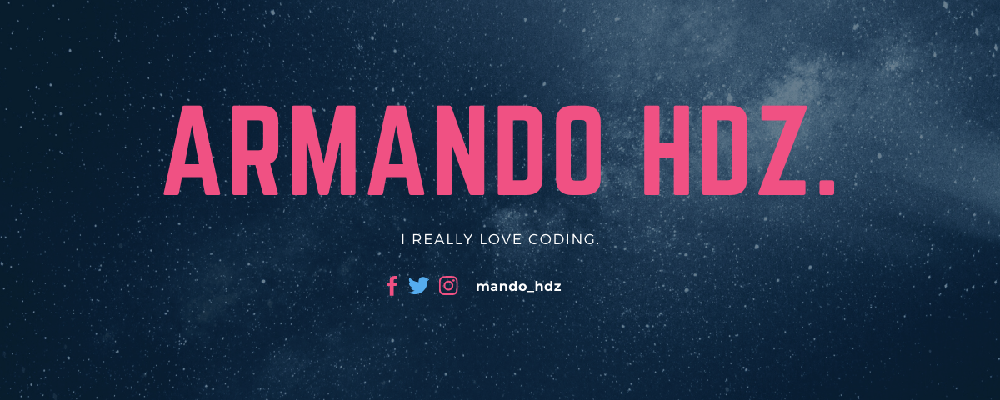

---

### About Me 

```js
const about = {
    me: {
        name: "Armando",
        nickname: "Mando",
        pronouns: "He/Him",
        ocupation: "Student",
    },
    code: ["JavaScript", "PHP"],
    tools: {
        frameworks: ["Laravel", "React"]
    }
}

```

---

### My Certifications

<a href="https://drive.google.com/file/d/1YTvP0F2aC4yDQfsgWCs2LuNGiwFhXlvA/view" target="_blank"></a>

---
### Contact Me

[][linkedin]

<br>

[linkedin]: https://www.linkedin.com/in/armandohernandez-7a30341b5/

[kj]: https://media.tenor.com/hWg8g8VHhjoAAAAi/yaseen.gif